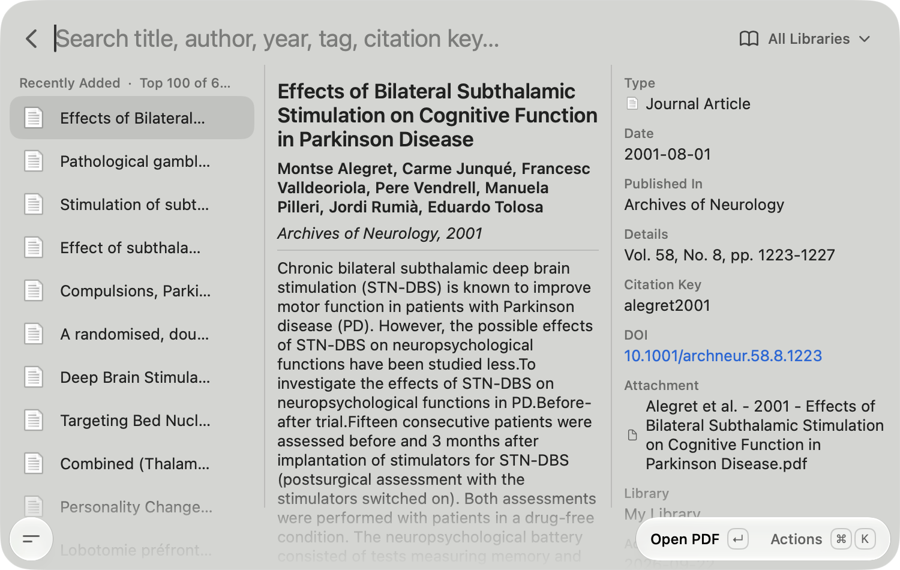

<div align="center">


# Zotero for Tinycast

Search your Zotero library from [Tinycast](https://tinycast.dev) — open PDFs, jump to items, and copy
citations, BibTeX and citation keys without leaving the keyboard.

Also a regular Raycast extension, and fast on libraries of any size.

</div>



## Why this exists

The Zotero extension in the Raycast Store never gets past **Loading…** in Tinycast. It reads the
whole `zotero.sqlite` into JavaScript and opens it with a WebAssembly build of SQLite. That's fine in
Raycast's Node.js, but Tinycast runs extensions in JavaScriptCore without Node, where a large library
has to cross the native bridge as one enormous string.

This extension never moves the database into JavaScript:

- **Library** — macOS's own `/usr/bin/sqlite3` queries `zotero.sqlite` in place and returns only item
  metadata (about 1.5 MB for 600 items, in ~15 ms). It opens the file with `immutable=1`, so it works
  while Zotero is running and holding its lock.
- **Citations** — the running Zotero app formats bibliography entries and in-text citations through its
  local API, using any CSL style you have installed. BibTeX comes from Better BibTeX when it's
  installed, so the keys match the ones in your `.bib` files.

## Features

- Search by title, author, year, journal, tag, DOI or citation key, with accents ignored
  (`jurgen` finds *Jürgen*)
- Filter by library, group library or collection (subcollections included)
- Detail pane with authors, abstract, publication details, tags and collections
- Open the PDF in your default app or in Zotero's reader, or reveal the item in Zotero
- Copy a bibliography entry as plain text or as rich text that keeps italics in Word and Pages,
  or paste it straight into the frontmost app
- Copy an in-text citation, BibTeX, the citation key, `[@key]` for Pandoc or `\cite{key}` for LaTeX
- Copy the PDF path (optionally quoted) or show the PDF in Finder

| Shortcut | Action |
| --- | --- |
| <kbd>↵</kbd> | Open PDF (configurable) |
| <kbd>⌘</kbd> <kbd>O</kbd> | Show in Zotero |
| <kbd>⌘</kbd> <kbd>⇧</kbd> <kbd>O</kbd> | Open PDF in Zotero |
| <kbd>⌘</kbd> <kbd>L</kbd> | Open DOI or URL |
| <kbd>⌘</kbd> <kbd>⇧</kbd> <kbd>C</kbd> | Copy bibliography entry |
| <kbd>⌘</kbd> <kbd>⌥</kbd> <kbd>C</kbd> | Copy formatted bibliography entry |
| <kbd>⌘</kbd> <kbd>⇧</kbd> <kbd>V</kbd> | Paste bibliography entry |
| <kbd>⌘</kbd> <kbd>⇧</kbd> <kbd>I</kbd> | Copy in-text citation |
| <kbd>⌘</kbd> <kbd>⇧</kbd> <kbd>B</kbd> | Copy BibTeX |
| <kbd>⌘</kbd> <kbd>.</kbd> | Copy citation key |
| <kbd>⌘</kbd> <kbd>⇧</kbd> <kbd>.</kbd> | Copy Pandoc citation |
| <kbd>⌘</kbd> <kbd>⇧</kbd> <kbd>P</kbd> | Copy PDF path |
| <kbd>⌘</kbd> <kbd>⇧</kbd> <kbd>D</kbd> | Toggle details |
| <kbd>⌘</kbd> <kbd>R</kbd> | Reload library |

## Install in Tinycast

Tinycast builds extensions from GitHub itself, so you need [Node.js](https://nodejs.org) installed
(Homebrew, nvm, Volta, mise and friends are all found automatically).

1. Open **Tinycast Settings → Extensions → Registries…**
2. Click **Add Registry…**, paste `richarddemann/zotero-tinycast` and click **Add**.
3. Click **Search…**, type `zotero`, and **Install** the result from this registry.
4. Optional: give **Search Zotero** a hotkey in the same settings pane.

If you still have the Raycast Store's *Search Zotero* installed, uninstall it so you don't open the one
that hangs by accident.

### From source

```sh
git clone https://github.com/richarddemann/zotero-tinycast
cd zotero-tinycast/extensions/zotero
npm install
npm run install-tinycast
```

## Install in Raycast

```sh
git clone https://github.com/richarddemann/zotero-tinycast
cd zotero-tinycast/extensions/zotero
npm install
npm run dev
```

## Setup

| Preference | Default | Notes |
| --- | --- | --- |
| Zotero Database | `~/Zotero/zotero.sqlite` | Your Zotero data directory is shown in *Zotero Settings → Advanced → Files and Folders*. |
| Citation Style | APA | Must also be installed in Zotero (*Settings → Cite*). |
| Primary Action | Open PDF | Or open the PDF in Zotero, or show the item in Zotero. |
| PDF Path Copy | Off | Wraps copied paths in quotation marks. |

Searching and opening PDFs work with Zotero closed. **Citation and BibTeX actions need Zotero running**
with *Settings → Advanced → Allow other applications on this computer to communicate with Zotero*
turned on.

## Troubleshooting

**"Couldn't read your Zotero library"** — the database path is wrong. Point the *Zotero Database*
preference at the `zotero.sqlite` inside your data directory.

**"Couldn't get citation from Zotero"** — Zotero isn't running, or the local API setting above is off.
If only one style fails, install that style in Zotero.

**BibTeX keys differ from my `.bib` file** — install [Better BibTeX](https://retorque.re/zotero-better-bibtex/).
Without it, Zotero's built-in BibTeX export makes up its own keys.

**New items don't show up** — press <kbd>⌘</kbd> <kbd>R</kbd>. The library is read fresh every time
the command opens.

## How it works

```
extensions/zotero/src/
├── search-zotero.tsx   UI: list, detail pane, actions, search ranking
└── zotero.ts           sqlite3 queries, attachment paths, Zotero local API, rich-text copy
```

- One SQL query returns every regular item with its fields, creators, tags, collections and
  attachments as JSON (`json_group_object`/`json_group_array`), so the whole library loads in a single
  `sqlite3` call.
- Search ranks exact citation-key matches first, then matches at the start of a word in the title or
  author list, then anywhere else. Every word you type has to match.
- Tinycast's clipboard only takes plain text, so formatted entries go through `textutil` (HTML → RTF)
  and `pbcopy`, which puts RTF input on the pasteboard as rich text.

## Credits

Inspired by the Raycast Store [Zotero extension](https://www.raycast.com/reckoning-dev/zotero) by
reckoning-dev and contributors, whose MIT-licensed item-type icons this extension reuses.

## License

[MIT](LICENSE)
